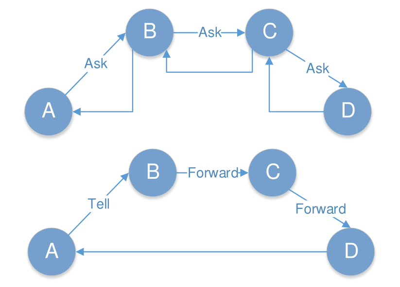

Akka.NET offers two kinds of actor base types: 
 - ReceiveActor 
 - UntypedActor
 
 The difference between the two, as we are going to see, is the signature for receiving messages. One is strongly typed, while the other is not. The usage of one or the other would most probably depend on the use case and handling of types of incoming messages.

 # Actor instantiation
 Creating a new instance of an actor can only be done through the <code>ActorSystem</code>. The <code>ActorSystem</code> offers two methods: <code>ActorOf</code> and <code>ActorOf<T></code>, which are responsible for the actor’s creation.

 In order to be identified, an ActorSystem has to have a name. This is mainly needed in order to ensure the actor’s location, as we are going to see later on. For example <code>my-first-akka</code>

```csharp
static void Main(string[] args)
{
    ActorSystem system = ActorSystem.Create("my-first-akka");

    IActorRef typedActor = system.ActorOf<MyTypedActor>();
    IActorRef untypedActor = system.ActorOf<MyUntypedActor>();
}
```

The alternative to ActorOf’s generic version is to use the nongeneric version, which accepts different parameters: we have to supply a parameter of type Props. Props is a configuration class to specify options for the creation of actors. By using Props, we can define a SupervisionStrategy, create the actor by its constructor attributes, or specify a Factory for it.

```csharp
static void Main(string[] args)
{
    ActorSystem system = ActorSystem.Create("my-first-akka");

    Props typedActorProps = Akka.Actor.Props.Create<MyTypedActor>();
    Props untypedActorProps = Akka.Actor.Props.Create<MyUntypedActor>();

    //option creating Props
    Props props1=Props.Create(typeof(MyTypedActor));
    Props props2=Props.Create(() => new MyTypedActor("arg"));
    Props props3=Props.Create<MyTypedActor>();
    Props props4=Props.Create(typeof(MyTypedActor), "arg");


    IActorRef typedActor = system.ActorOf(typedActorProps);
    IActorRef untypedActor = system.ActorOf(untypedActorProps);
}

```

# IActorRef
<code>IActorRef</code> is a *handle* to an actor. Having a reference to an actor guarantees that the actor is alive, or that it existed in the past Unfortunately, this handle doesn’t answer the question of whether or not the actor is still alive.

Among others, it contains three methods that enable communication between actors, being local or remote: <code>Ask</code>, <code>Tell</code>, and <code>Forward</code>.

## Tell
The <code>Tell</code> method uses the fire-and-forget pattern; using Tell, one actor simply sends a message to another actor and doesn’t wait for any response back, and it returns immediately (it is a nonblocking call). Within a given Actor, there is an implicit property called <code>Context</code>. We can use <code>Context</code> to determine the parent of the Actor, and <code>Context.Parent</code>. <code>Context.System</code> can be used to access the root <code>ActorSystem</code>, under which the Actor resides. You can get a reference to the Actor itself
using <code>Context.Self</code>.

## Forward
Forward is a special method of Tell, where the sender information will be carried as part of the message context, which means that even if the message goes through several actors, the original actor that sent the message will be preserved in this context.

## Ask
Ask is a request/response-based communication pattern: it sends a message to another actor, expecting it to respond with another message, and returns a Task, asynchronously notifying when the response will come back.

In general, there are performance implications for using Ask, since under the hood there is quite some work to be done in order to enable the mechanics of mapping the request with the response, etc. So, you should prefer using Tell for performance, and only use Ask if you have no other choice.

As an alternative of Ask, we can always use Tell or Forward, and return back the message in a fluent manner



# Actor Termination
In this section, we are going to explain how to terminate an actor: how to programmatically
make sure that an actor will be terminated. There are several ways to achieve this:

## Calling the <code>ActorContext.Stop()</code> method.
Stopping an actor can be done by using the ActorContext.Stop method. This is available in a few places, such as:
- The <code>ActorSystem</code> contains the Stop method, to which we can pass the actual actor reference.
- The actor itself has the ability to call the Stop method by calling <code>Context.Stop(Self)</code>.
- The actor can stop child actors by calling <code>Context.Stop(childActorReference)</code>.

```csharp
static void Main(string[] args)
{
    ActorSystem system = ActorSystem.Create("my-first-akka");

    IActorRef emailSender = system.ActorOf<EmailSenderActor>("emailSender");
    EmailMessage emailMessage = new EmailMessage("from@mail.com", "to@mail.com", "Hi");
    emailSender.Tell(emailMessage);

    system.Stop(emailSender);
    
    system.Terminate();
}
```

## Sending the <code>PoisonPill</code> message.
PoisonPill is a special kind of message (system message) that instructs the actor to shut itself down after receiving this kind of message.

```csharp
static void Main(string[] args)
{
    ActorSystem system = ActorSystem.Create("my-first-akka");

    IActorRef emailSender = system.ActorOf<EmailSenderActor>("emailSender");
    EmailMessage emailMessage = new EmailMessage("from@mail.com", "to@mail.com", "Hi");

    emailSender.Tell(emailMessage);
    emailSender.Tell(emailMessage);
    emailSender.Tell(PoisonPill.Instance);
    emailSender.Tell(emailMessage);

    Thread.Sleep(1000);
    
    system.Terminate();
}
```


## Sending the <code>Kill</code> message.
Killing an actor is very similar to sending the PoisonPill message, which we have previously seen. The system offers the Kill.Instance message to be passed to the actor. The difference in this case is that when the actor encounters this kind of message, an exception will be throw (ActorKilledExeption). This can be pretty useful if we want to show in logs that the actor was terminated.

```csharp
static void Main(string[] args)
{
    ActorSystem system = ActorSystem.Create("my-first-akka");

    IActorRef emailSender = system.ActorOf<EmailSenderActor>("emailSender");
    EmailMessage emailMessage = new EmailMessage("from@mail.com", "to@mail.com", "Hi");

    emailSender.Tell(emailMessage);
    emailSender.Tell(emailMessage);
    emailSender.Tell(Kill.Instance);
    emailSender.Tell(emailMessage);

    Thread.Sleep(1000);
    
    system.Terminate();
}
```

## Using the <code>GracefulStop</code>
<code>IActorRef</code> also offers the <code>GracefulStop</code> method. By default, this method sends a <code>PoisionPill</code> and will return to your caller a <code>Task<bool></code>, which will complete within the timeout you specify.


```csharp
static void Main(string[] args)
{
    ActorSystem system = ActorSystem.Create("my-first-akka");

    IActorRef emailSender = system.ActorOf<EmailSenderActor>("emailSender");
    EmailMessage emailMessage = new EmailMessage("from@mail.com", "to@mail.com", "Hi");

    emailSender.Tell(emailMessage);
    
    var result = emailSender.GracefulStop(TimeSpan.FromSeconds(10));

    Thread.Sleep(1000);
    
    system.Terminate();
}
```

## Terminating the <code>ActorSystem</code>
Terminating the <code>ActorSystem</code>, will terminate the actors which refer to it.